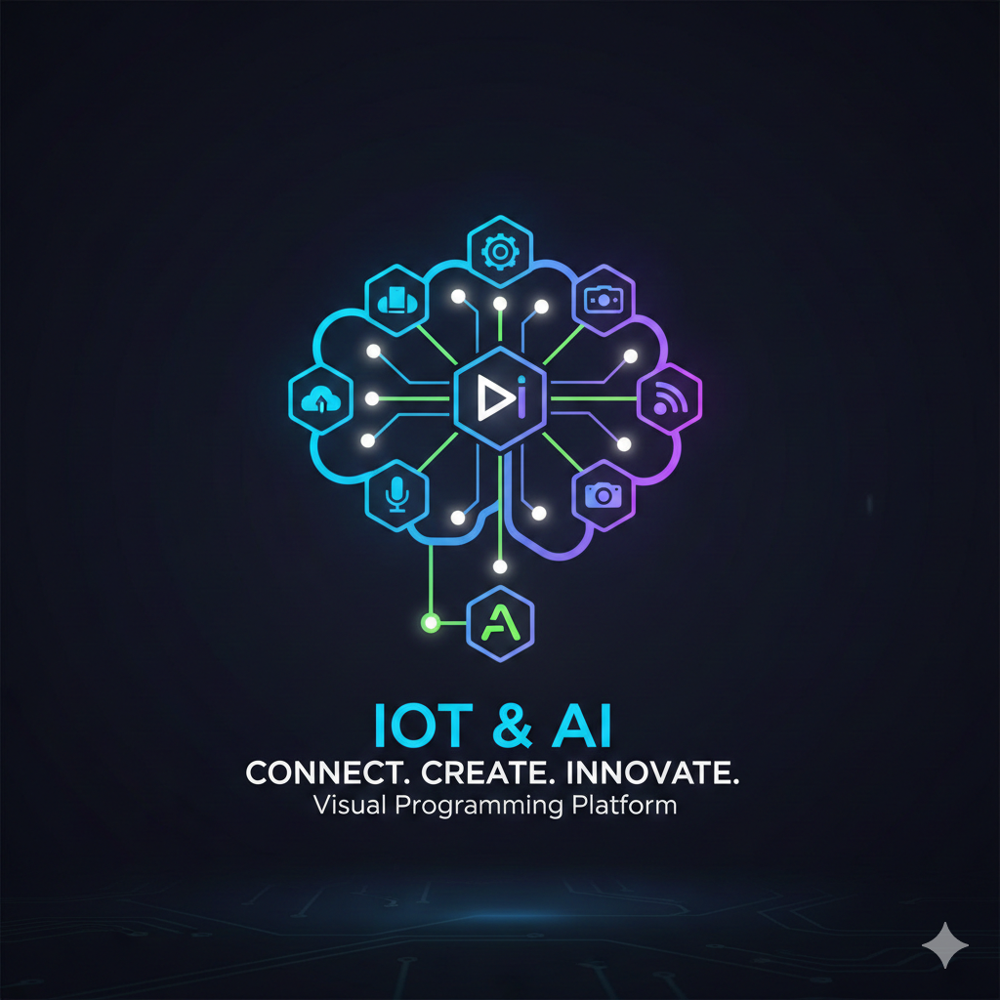
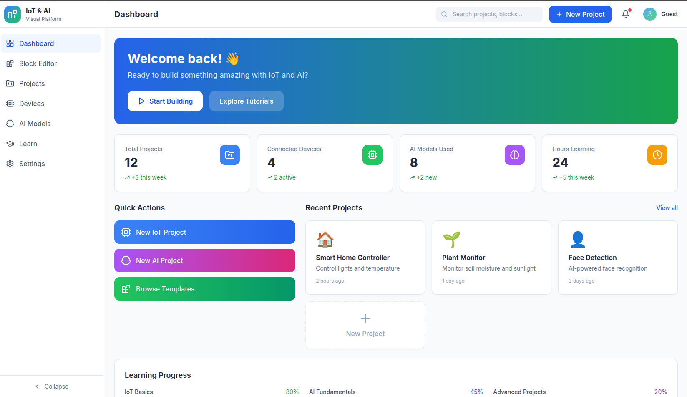
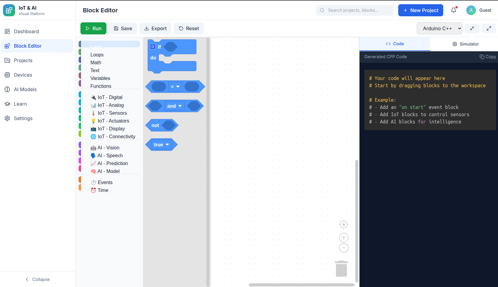
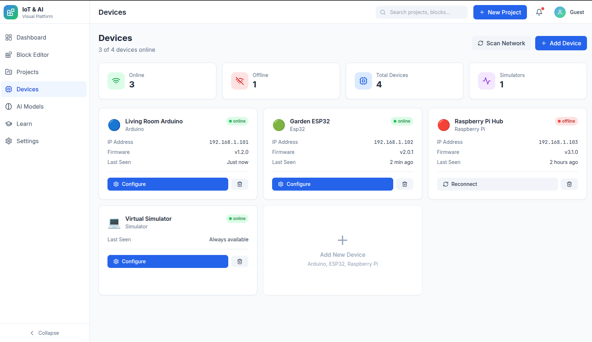
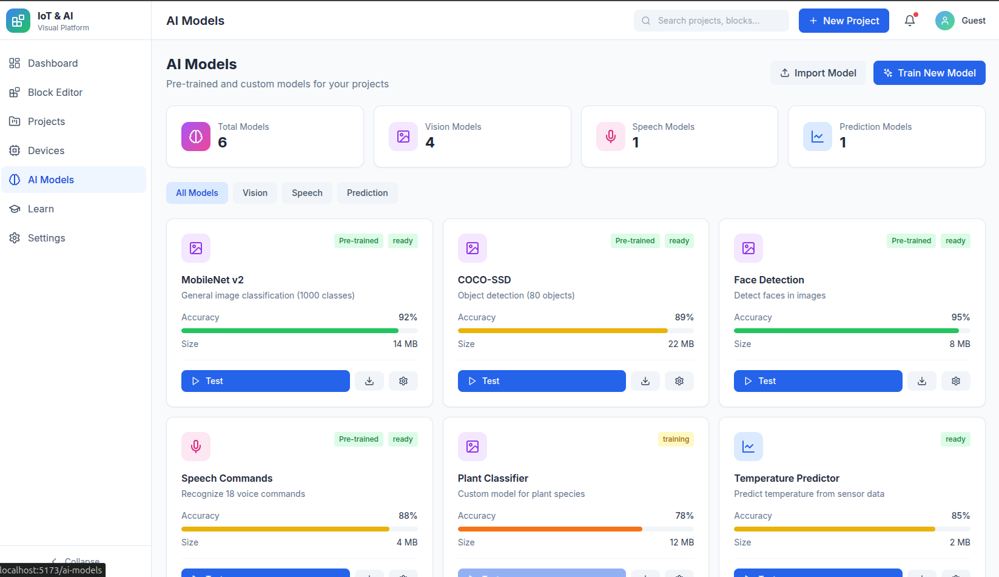

<p align="center">
  
</p>

<h1 align="center">IoT & AI Visual Programming Platform</h1>

<p align="center">
  <strong>An intuitive, block-based visual programming platform for IoT and AI/ML development</strong>
</p>

<p align="center">
  <a href="#features">Features</a> •
  <a href="#screenshots">Screenshots</a> •
  <a href="#quick-start">Quick Start</a> •
  <a href="#usage-guide">Usage Guide</a> •
  <a href="#api-documentation">API Docs</a> •
  <a href="#contributing">Contributing</a>
</p>

---

## 🎯 Overview

This platform enables students (school to university level) to **design, build, and deploy IoT and AI/ML solutions** without deep prior coding knowledge—while allowing smooth transition to real code as skills grow.

### Who is this for?

| User Type | Use Cases |
|-----------|-----------|
| 🎓 **School Students** | Simple blocks, instant feedback, simulations |
| 🏫 **University Students** | Advanced logic, real hardware, AI models |
| 👨‍🏫 **Educators** | Curriculum tools, assignments, assessment |
| 🔧 **Makers & Beginners** | Rapid prototyping, learning IoT/AI |

---

## ✨ Features

### 🧩 Visual Block Editor
- Drag-and-drop programming with Google Blockly
- 50+ custom blocks for IoT and AI
- Real-time code generation (Python, C++, JavaScript)
- Event-driven programming support

### 🔌 IoT Capabilities
- **Hardware Support**: Arduino, ESP32, Raspberry Pi
- **Sensors**: Temperature, humidity, distance, light, motion
- **Actuators**: LED, servo, buzzer, DC motors, displays
- **Connectivity**: WiFi, MQTT, HTTP/REST APIs
- **Device Simulator**: Learn without physical hardware

### 🤖 AI/ML Features
- **Computer Vision**: Image classification, object detection, face detection
- **Speech**: Speech-to-text, text-to-speech, voice commands
- **Prediction**: Time-series forecasting, anomaly detection
- **Pre-trained Models**: MobileNet, COCO-SSD, and more
- **Custom Models**: Train your own with AutoML

### 📊 Dashboard & Analytics
- Project management and organization
- Device status monitoring
- Sensor data visualization
- Learning progress tracking

### 📚 Learning System
- Interactive tutorials and courses
- Difficulty levels (Beginner → Advanced)
- XP and achievement system
- Curriculum-aligned content

---

## 📸 Screenshots

<!-- Add your screenshots here -->
<details>
<summary>Click to view screenshots</summary>

### Dashboard


### Block Editor


### Projects


### Devices


### AI Models


### Learning


</details>

---

## 🚀 Quick Start

### Prerequisites

- **Node.js** 18+ ([Download](https://nodejs.org/))
- **Python** 3.10+ ([Download](https://python.org/))
- **npm** or **yarn**

### Installation

```bash
# Clone the repository
git clone https://github.com/yourusername/iot-ai-platform.git
cd iot-ai-platform

# Install all dependencies (frontend + backend)
npm run install:all

# Start development servers
npm run dev
```

### Access the Application

| Service | URL |
|---------|-----|
| 🌐 Frontend | http://localhost:5173 |
| 🔧 Backend API | http://localhost:8000 |
| 📖 API Documentation | http://localhost:8000/docs |

---

## 📖 Usage Guide

### 1. Getting Started

1. **Open the application** at http://localhost:5173
2. **Explore the Dashboard** to see your projects and learning progress
3. **Click "New Project"** or navigate to the Block Editor

### 2. Creating Your First Project

#### Step 1: Open the Block Editor
Navigate to the **Block Editor** from the sidebar or click "Start Building" on the dashboard.

#### Step 2: Drag Blocks
From the toolbox on the left, drag blocks onto the workspace:

- **Events** → Start with "when program starts"
- **IoT - Digital** → Add "set digital pin" blocks
- **Time** → Add "wait" blocks for delays

#### Step 3: Build a Blink Program
```
⚡ when program starts
  └── 🔄 repeat forever
        └── 💡 set LED pin 13 ON
        └── ⏰ wait 1000 ms
        └── 💡 set LED pin 13 OFF
        └── ⏰ wait 1000 ms
```

#### Step 4: View Generated Code
The right panel shows the generated Python/C++ code in real-time.

#### Step 5: Run or Export
- Click **Run** to test in the simulator
- Click **Export** to download the code
- Click **Save** to save your project

### 3. Working with IoT Blocks

#### Sensors
```
🌡️ read temperature DHT11 pin 4     → Returns temperature in °C
💧 read humidity DHT11 pin 4        → Returns humidity %
📏 read distance trig 9 echo 10     → Returns distance in cm
💡 read light level pin A0          → Returns 0-1023
🏃 motion detected pin 7            → Returns true/false
```

#### Actuators
```
💡 set LED pin 13 ON/OFF            → Control LEDs
🔄 set servo pin 9 angle 90         → Control servo motors
🔊 buzzer pin 8 frequency 1000 Hz   → Play tones
🚗 motor A forward speed 255        → Control DC motors
```

#### Connectivity
```
📡 connect WiFi "SSID" "password"   → Connect to WiFi
🔗 connect MQTT broker "url" 1883   → Connect to MQTT
📤 MQTT publish to "topic" message  → Send MQTT message
📥 MQTT subscribe to "topic"        → Receive MQTT messages
🌐 HTTP GET "url"                   → Make HTTP requests
```

### 4. Working with AI Blocks

#### Computer Vision
```
📷 capture image from camera        → Take a photo
🏷️ classify image MobileNet         → Identify objects
🔍 detect objects COCO-SSD          → Find multiple objects
👤 detect faces                      → Find faces in image
```

#### Speech
```
🎤 listen for speech                → Speech to text
🔊 speak "Hello World"              → Text to speech
🎯 wait for command "turn on"       → Voice commands
```

#### Prediction
```
📈 predict from data [...]          → Time series prediction
🏷️ classify data [...]              → Data classification
⚠️ is anomaly value                 → Anomaly detection
```

### 5. Managing Devices

1. Navigate to **Devices** from the sidebar
2. Click **"Add Device"** to register new hardware
3. Select device type: Arduino, ESP32, Raspberry Pi, or Simulator
4. Enter device details (name, IP address if applicable)
5. Use **Configure** to adjust device settings
6. Click **Reconnect** if a device goes offline

### 6. Learning & Tutorials

1. Go to **Learn** from the sidebar
2. **Continue Learning** - Resume your current course
3. **Tutorials** - Browse by category (IoT/AI) and difficulty
4. Complete tutorials to earn **XP** and track progress
5. Locked tutorials unlock as you progress

---

## 🏗️ Project Structure

```
iot-ai-platform/
├── frontend/                    # React + TypeScript frontend
│   ├── src/
│   │   ├── components/          # Reusable UI components
│   │   │   ├── Layout.tsx       # Main layout wrapper
│   │   │   ├── Sidebar.tsx      # Navigation sidebar
│   │   │   ├── Header.tsx       # Top header bar
│   │   │   ├── CodeView.tsx     # Code display panel
│   │   │   └── SimulatorPanel.tsx
│   │   ├── pages/               # Page components
│   │   │   ├── Dashboard.tsx    # Home dashboard
│   │   │   ├── Editor.tsx       # Block editor
│   │   │   ├── Projects.tsx     # Project management
│   │   │   ├── Devices.tsx      # Device management
│   │   │   ├── AIModels.tsx     # AI model management
│   │   │   ├── Learn.tsx        # Tutorials & courses
│   │   │   └── Settings.tsx     # User settings
│   │   ├── blocks/              # Custom Blockly blocks
│   │   │   └── index.ts         # IoT & AI block definitions
│   │   ├── services/            # API services
│   │   │   └── api.ts           # Axios API client
│   │   ├── store/               # Zustand state management
│   │   │   └── index.ts         # Global state store
│   │   ├── App.tsx              # Root component
│   │   └── main.tsx             # Entry point
│   ├── package.json
│   └── vite.config.ts
│
├── backend/                     # FastAPI Python backend
│   ├── app/
│   │   ├── api/                 # API routes
│   │   │   ├── routes/
│   │   │   │   ├── auth.py      # Authentication
│   │   │   │   ├── projects.py  # Project CRUD
│   │   │   │   ├── devices.py   # Device management
│   │   │   │   ├── ai_models.py # AI model management
│   │   │   │   ├── code.py      # Code generation
│   │   │   │   └── tutorials.py # Learning system
│   │   │   └── __init__.py      # Router aggregation
│   │   ├── core/                # Core utilities
│   │   │   ├── config.py        # Settings & configuration
│   │   │   ├── database.py      # Database setup
│   │   │   └── security.py      # JWT authentication
│   │   ├── models/              # SQLAlchemy models
│   │   │   └── __init__.py      # Database models
│   │   ├── schemas/             # Pydantic schemas
│   │   │   └── __init__.py      # Request/Response schemas
│   │   ├── services/            # Business logic
│   │   │   └── code_generator.py
│   │   └── main.py              # FastAPI app entry
│   └── requirements.txt
│
├── docs/                        # Documentation
│   └── screenshots/             # Application screenshots
├── package.json                 # Root package.json
└── README.md                    # This file
```

---

## 🔧 Technology Stack

### Frontend
| Technology | Purpose |
|------------|---------|
| React 18 | UI framework |
| TypeScript | Type safety |
| Blockly | Visual programming |
| TailwindCSS | Styling |
| Zustand | State management |
| React Router | Navigation |
| Axios | HTTP client |
| Recharts | Data visualization |

### Backend
| Technology | Purpose |
|------------|---------|
| FastAPI | Web framework |
| SQLAlchemy | ORM |
| SQLite/PostgreSQL | Database |
| Pydantic | Data validation |
| JWT | Authentication |
| MQTT | IoT messaging |

### AI/ML
| Technology | Purpose |
|------------|---------|
| TensorFlow.js | Browser ML |
| MobileNet | Image classification |
| COCO-SSD | Object detection |
| Web Speech API | Voice features |

---

## 📡 API Documentation

### Authentication

```http
POST /api/auth/register
POST /api/auth/login
GET  /api/auth/me
```

### Projects

```http
GET    /api/projects/           # List all projects
POST   /api/projects/           # Create project
GET    /api/projects/{id}       # Get project
PUT    /api/projects/{id}       # Update project
DELETE /api/projects/{id}       # Delete project
POST   /api/projects/{id}/duplicate
```

### Devices

```http
GET    /api/devices/            # List devices
POST   /api/devices/            # Register device
GET    /api/devices/{id}        # Get device
PUT    /api/devices/{id}        # Update device
DELETE /api/devices/{id}        # Remove device
POST   /api/devices/{id}/ping   # Ping device
POST   /api/devices/{id}/upload # Upload code
```

### Code Generation

```http
POST /api/code/generate         # Generate code from blocks
POST /api/code/validate         # Validate generated code
GET  /api/code/templates/{name} # Get code template
```

Full API documentation available at http://localhost:8000/docs

---

## 🛠️ Development

### Running in Development Mode

```bash
# Terminal 1: Frontend
cd frontend && npm run dev

# Terminal 2: Backend
cd backend && uvicorn app.main:app --reload --port 8000
```

### Building for Production

```bash
# Build frontend
cd frontend && npm run build

# The built files will be in frontend/dist/
```

### Environment Variables

Create a `.env` file in the backend directory:

```env
SECRET_KEY=your-secret-key-here
DATABASE_URL=sqlite+aiosqlite:///./platform.db
MQTT_BROKER=localhost
MQTT_PORT=1883
```

---

## 🤝 Contributing

Contributions are welcome! Please feel free to submit a Pull Request.

1. Fork the repository
2. Create your feature branch (`git checkout -b feature/AmazingFeature`)
3. Commit your changes (`git commit -m 'Add some AmazingFeature'`)
4. Push to the branch (`git push origin feature/AmazingFeature`)
5. Open a Pull Request

---

## 📄 License

This project is licensed under the MIT License - see the [LICENSE](LICENSE) file for details.

---

## 🙏 Acknowledgments

- [Google Blockly](https://developers.google.com/blockly) for the visual programming framework
- [FastAPI](https://fastapi.tiangolo.com/) for the excellent Python web framework
- [TensorFlow.js](https://www.tensorflow.org/js) for browser-based machine learning

---

<p align="center">
  Made with ❤️ for IoT and AI education
</p>
